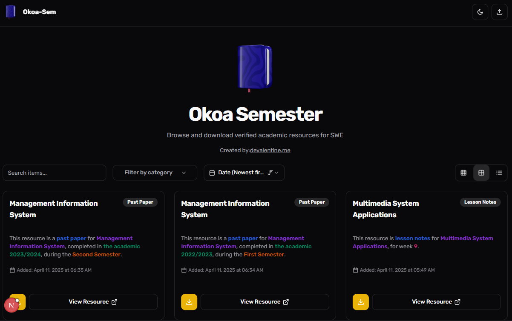
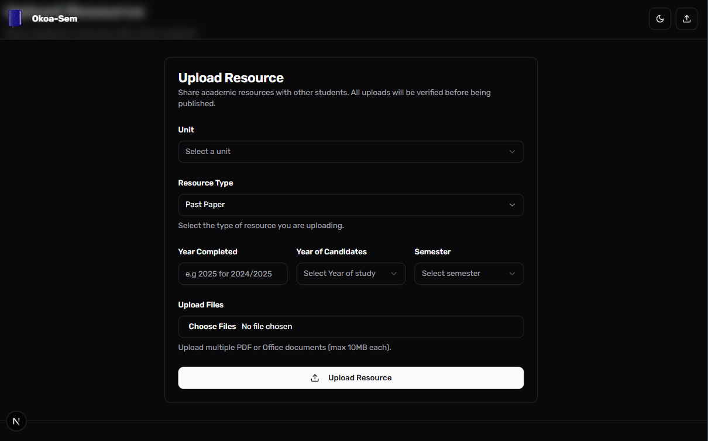
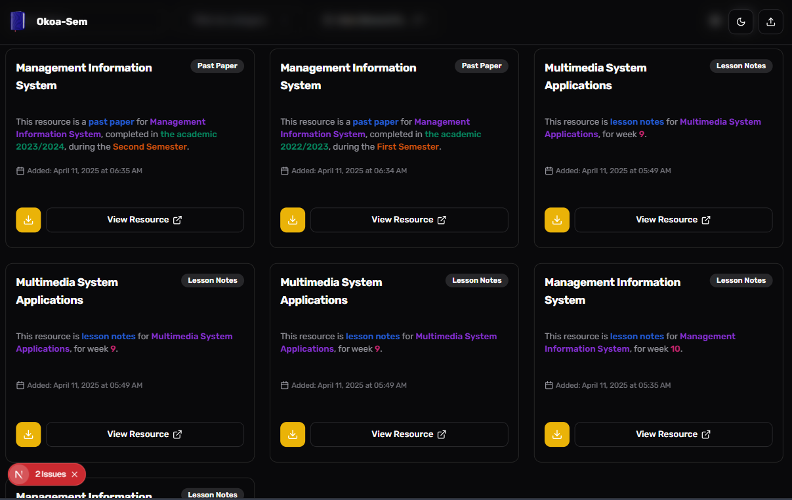
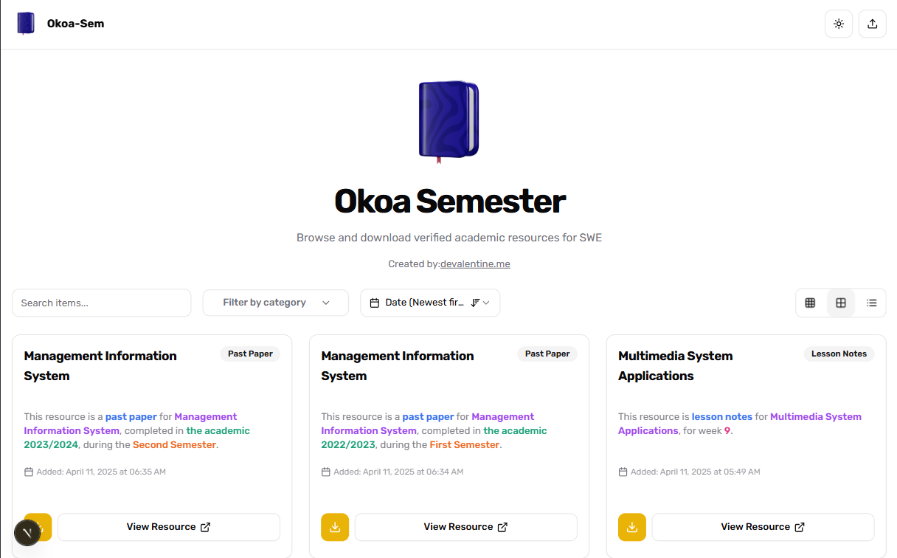
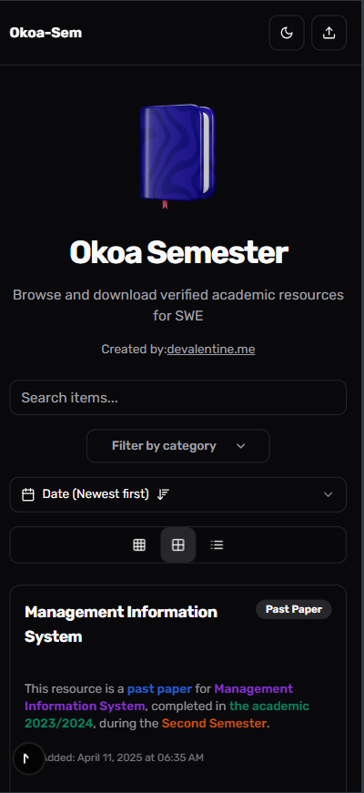

# 📚 Okoa-Sem - Student Resource Sharing Platform

   

A zero-auth academic hub for students to share verified resources. Upload past papers & notes, download peer-approved materials, and enjoy smooth animations - all without logging in!



## 🌟 Features
- **📤 One-Click Uploads**
  Drag-and-drop interface with metadata tagging (year, semester, resource type)
- **🛡️ Manual Verification**
  Supabase dashboard moderation before publication
- **🎨 Dynamic Animations**
  Gradient hover effects & card entrance animations
- 🌓 **Theme Toggler**
  Smooth light/dark mode transition
- **📱 Mobile-First Design**
  Fully responsive grid layout
- **🔒 Secure Backend**
  Server-side operations with Prisma ORM

## 🛠 Tech Stack
### Frontend
  

### Backend
  

### Tooling
 

## 🚀 Getting Started

### Prerequisites
- Node.js 18.x+
- pnpm 9.x+
- Supabase account

### Installation
```bash
git clone https://github.com/devalentineomonya/Okoa-Sem-NextJs-Ts-Prisma-Supabase.git
cd Okoa-Sem-NextJs-Ts-Prisma-Supabase
pnpm install
```

### Configuration
1. Create `.env.local`:
```env
NEXT_PUBLIC_SUPABASE_URL=your_project_url
NEXT_PUBLIC_SUPABASE_ANON_KEY=your_anon_key
SUPABASE_SERVICE_ROLE_KEY=your_service_key
```

2. Initialize database:
```bash
pnpm  prisma db push
```

3. Start development server:
```bash
pnpm run dev
```

## 🧑💻 Development

### Project Structure
```
okoa-sem/
├── app/
│   ├── upload/          # Resource upload page
│   ├── resources/       # Public download section
│   └── api/             # Secure server actions
├── components/
│   └── ResourceCard/    # Animated card component
├── lib/
│   └── supabase/        # Storage & DB client
└── prisma/
    └── schema.prisma    # Resource metadata model
```

### Key Implementation Details
- **Resource Card Animations**
  Uses Framer Motion for:
  ```tsx
  <motion.div
    initial={{ y: 50, opacity: 0 }}
    animate={{ y: 0, opacity: 1 }}
    whileHover={{ background: "linear-gradient(...)" }}
  >
  ```

- **Theme Toggle**
  Context API + CSS Variables:
  ```css
  :root {
    --primary-bg: #ffffff;
    --primary-text: #000000;
  }

  [data-theme="dark"] {
    --primary-bg: #000000;
    --primary-text: #ffffff;
  }
  ```

## 🔒 Security
- **Row-Level Security**
  Supabase policies for resource moderation
- **Server-Side Validation**
  All uploads processed via Next.js API routes
- **Env Protection**
  Sensitive keys never exposed to client
- **Content Scanning**
  Manual verification prevents malware uploads

## 📸 Screenshots
| Upload Interface | Resource Cards |
|------------------|----------------|
|  |  |

| Dark Mode | Mobile View |
|-----------|-------------|
|  |  |

## 🌐 Deployment
[](https://vercel.com/new/clone?repository-url=https%3A%2F%2Fgithub.com%2Fdevalentineomonya%2FOkoa-Sem-NextJs-Ts-Prisma-Supabase)

**Admin Setup:**
1. Enable Supabase Storage
2. Create moderation policy in SQL:
```sql
CREATE POLICY "Manual approval" ON storage.objects
FOR INSERT WITH CHECK (bucket_id = 'pending-approval');
```

## 🤝 Contributing
1. Fork the repository
2. Create feature branch: `git checkout -b feat/your-feature`
3. Follow our [Contributiion](CONTRIBUTION.md)
4. Submit PR with:
   - Component tests
   - Screen recordings for UI changes
   - Updated documentation

## 📜 License
MIT License - See [LICENSE](LICENSE) for details.

---
🔧 Missing something? [Open an issue](https://github.com/devalentineomonya/Okoa-Sem-NextJs-Ts-Prisma-Supabase/issues)
